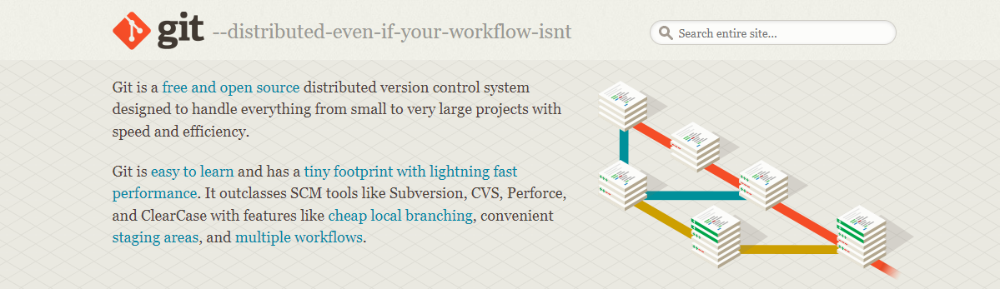

# Git-SourceTree-Study
<a herf="./doc/README_zh.md" style="text-decoration:none">中文</a>|<a herf="" style="text-decoration:none">English</a>|<a herf="./doc/README_ja.md" style="text-decoration:none">日本語</a>

It contains the main point about git and the usages of SourceTree which can help you to use git to improve your efficiency in working.

## Content

### Part 1 Introduction of Git 

​	I will share with you some basics about git and let you know  the Working Directory and Repository. Through this part you will know the principles of git.

### Part 2 Basic Git Usage

​	You can learn some commands which is used frequently and the entire Git process.

### Part3 Branches in Git

​	The use of branches is one of Git's strengths. I will teach you how to use branch to improve your ability to use Git.

### Part4 Git GUI SourceTree

​	In this section, you will learn about how to use the SourceTree. I will share with you the configuration in it which can help you to improve your efficiency with Git.